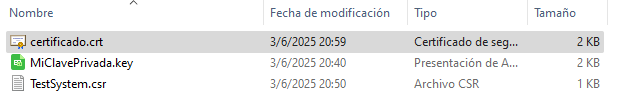
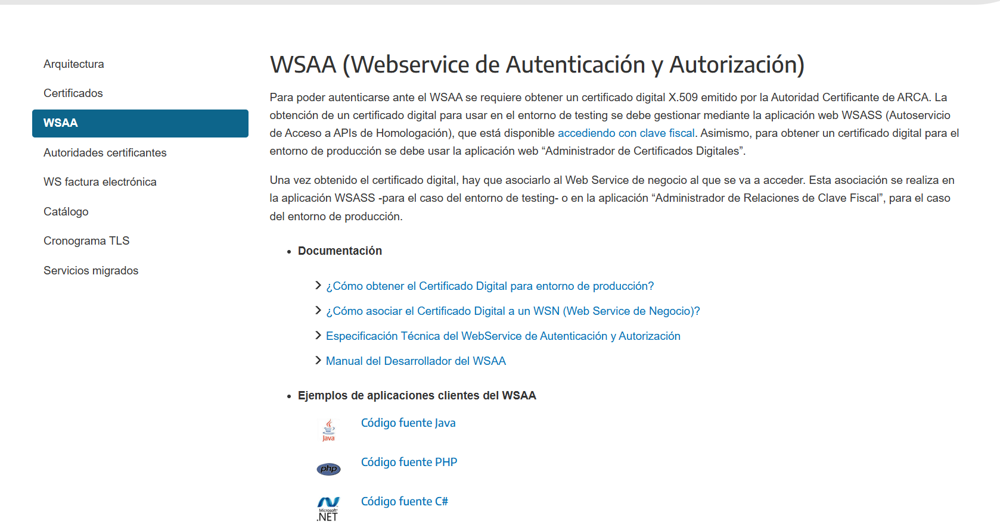
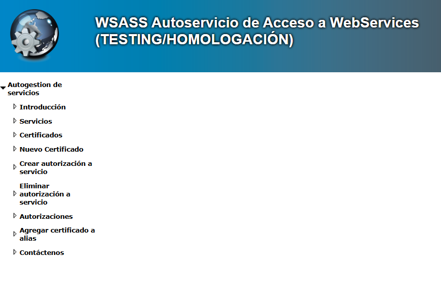
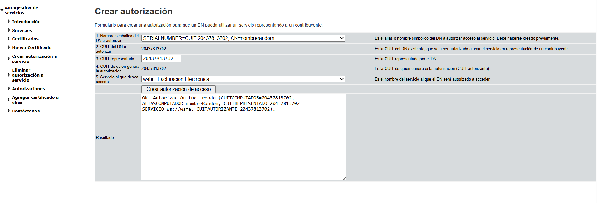

# Toda la información está sacada de [AFIP - ARCA](https://www.afip.gob.ar/ws/)

## proyecto de factura electronica

Empezar leyendo el pdf para desarrolladores [aquí](https://www.afip.gob.ar/fe/ayuda/documentos/WSSEG-ManualParaElDesarrollador_ARCA-0.9.pdf)

* ARCA permite 2 modos, el de **omologcion o testing**(recomendable para pruebas) y el de **producción**
* Recomiendo primero ir a la [documentación](https://www.afip.gob.ar/ws/documentacion/arquitectura-general.asp) 

## Arquitectura general de los procesos


Vamos a necesitar tener instalados los programas

* [Openssl](https://slproweb.com/products/Win32OpenSSL.html) -> le dan click al primero que les salga 
una ves instalado necesitamos Editar las variables de entorno de windows, la ruta que deben poner es (recomiendo que creen la ruta(path) en sistema y no para usuario):

```bash
C:\Program Files\OpenSSL-Win64\bin
```

despues abren CMD y ponen

```bash
openssl --version
```

una ves instalado onpenssl nos vamos a leer el manual de [certificados](https://www.afip.gob.ar/ws/WSASS/WSASS_manual.pdf).
Necesitamos generar un archivo .csr y la clave privada .key.
En la pagina 10 del pdf muestra "CÓMO GENERAR UNA SOLICITUD DE CERTIFICADO (CSR)".
Nos deja el codigo **PRIMERO DEBEMOS GENERAR LA CLAVE PRIVADA PARA DESPUES USARLA Y SACAR EL CERTIFICADO**

```bash
//hace que genere la clave privada de 2048 bits - borrar comentario
openssl genrsa -out MiClavePrivada.key 2048 
```

'Se recomienda usar una carpeta especifica para los archivos descargados del proyecto'


despues de estar en la carpeta especifica pegamos el codigo anterior y nos descargaria la clave:


* ahora tenemos que generar el archivo .CSR usando el codigo que se encuentra en el [pdf](https://www.afip.gob.ar/ws/WSASS/WSASS_manual.pdf) en la pagina 11

```bash
openssl req -new -key TestSystem.key
-subj "/C=AR/O=MiEmpresa/CN=TestSystem/serialNumber=CUIT 20123456789"
-out TestSystem.csr
```

Debemos modificar el codigo anterior con nuestros datos

en TestSystem.key -> ponemos el nombre de nuestro archivo.key
en MiEmpresa -> ponemos el nombre de nuestro comercio
en CUIT -> ponemos el del dueño del local, en este caso el nuestro
en TestSystem.csr pueden cambiarlo si gustan

como quedaria (recomiendo dejar los codigos en 1 linea para asegurar la ejecución):

```bash
openssl req -new -key MiClavePrivada.key -subj "/C=AR/O=TutorialDePrueba/CN=TestSystem/serialNumber=CUIT 20437813702" -out TestSystem.csr
```

Se les debe crear un nuevo archivo .csr


## Ahora vamos a utilizar ese archivo .csr 

* vamos a la pagina de [AFIP](https://auth.afip.gob.ar/contribuyente_/login.xhtml)
Entramos a nuestra cuenta de afip y en el buscador ponemos WSA  como estamos en ambiente de testing usamos ese, despues en produción lo cambiamos.

Una ves dentro dbemos reyenar los campos:

1. Nombre simbolico de DN -> ponemos el que querramos
2. CUIT del contribuyente (se pone automatico)
3. Solicitud de certificado en formato PKCS#10 -> debemos copiar el contenido de nuestro archivo .csr y pegarlo Luego le damos en "Crear DN y obtener certificado"
4. copiamos lo que nos da, vamos a nuestra carpeta donde tenemos los demas archivos, abrimos un bloc de notas y lo pegamos, pero al guardar le cambian la extension de .TXT a .crt (extension de certificado)


en nuestros archivos nos quedaria asi :


## CON ESOS 3 ARCHIVOS AHORA PODEMOS HACER EL PASO 1

-1 solicitar ticket de acceso a un WSN

En la web vamos [aquí](https://www.afip.gob.ar/ws/documentacion/wsaa.asp) .
Seleccionamos el lenguaje que vayamos a usar o directamente powershell(en este caso powerShell)
vamos a la carpeta descargada, a /souce y nos aparece el archivo wsaa-cliente.ps1 -> .ps1 es powershell dentro de ese archivo explica más de que hace cada parte. Antes de ejecutar el comando powershell debemos ir de nuevo a [AFIP](https://wsass-homo.afip.gob.ar/wsass/portal/main.aspx).
Seleccionamos "Crear autorización a servicio"

 y nos saldria algo como :
 

### RECUERDEN MODIFICAR EL CAMPO 5

5. Servicio al que desea acceder -> pongan wsfe - Facturacion Electronica (pueden escribirlo para encontrarlo mas rapido).

Una ves tengan la autorizacion creada, cambiamos los parametros del script y luego ejecutamos el script de powershell descargado (copian y ejecutan todo):
- Certificado -> certificado.crt
- ClavePrivada -> mi clave privada.key
- WsaaWsdl -> cambiamos la ruta solo en producción

**RECUERDEN TENER LA VENTANA DE POWERSHELL EN LA CARPETA DONDE ESTAN TODOS LOS ARCHIVOS NECESARIOS**

```bash
#
# Ejemplo de cliente del WSAA (webservice de autenticacion y autorizacion). 
# Consume el metodo LoginCms ejecutando desde la Powershell de Windows. 
# Muestra en stdout el login ticket response.
#
# REQUISITOS: openssl
#
# Parametros de linea de comandos:
#
#   $Certificado: Archivo del certificado firmante a usar
#   $ClavePrivada: Archivo de clave privada a usar
#   $ServicioId: ID de servicio a acceder
#   $OutXml: Archivo TRA a crear
#   $OutCms: Archivo CMS a crear
#   $WsaaWsdl: URL del WSDL del WSAA
#
[CmdletBinding()]
Param(
   [Parameter(Mandatory=$False)]
   [string]$Certificado="myCert.crt",
	
   [Parameter(Mandatory=$False)]
   [string]$ClavePrivada="myPrivate.key",
   
   [Parameter(Mandatory=$False)]
   [string]$ServicioId="wsfe",
   
   [Parameter(Mandatory=$False)]
   [string]$OutXml="LoginTicketRequest.xml",   
   
   [Parameter(Mandatory=$False)]
   [string]$OutCms="LoginTicketRequest.xml.cms",   

   [Parameter(Mandatory=$False)]
   [string]$WsaaWsdl = "https://wsaahomo.afip.gov.ar/ws/services/LoginCms?WSDL"    
)

$ErrorActionPreference = "Stop"

# PASO 1: ARMAR EL XML DEL TICKET DE ACCESO
$dtNow = Get-Date 
$xmlTA = New-Object System.XML.XMLDocument
$xmlTA.LoadXml('<loginTicketRequest><header><uniqueId></uniqueId><generationTime></generationTime><expirationTime></expirationTime></header><service></service></loginTicketRequest>')
$xmlUniqueId = $xmlTA.SelectSingleNode("//uniqueId")
$xmlGenTime = $xmlTA.SelectSingleNode("//generationTime")
$xmlExpTime = $xmlTA.SelectSingleNode("//expirationTime")
$xmlService = $xmlTA.SelectSingleNode("//service")
$xmlGenTime.InnerText = $dtNow.AddMinutes(-10).ToString("s")
$xmlExpTime.InnerText = $dtNow.AddMinutes(+10).ToString("s")
$xmlUniqueId.InnerText = $dtNow.ToString("yyMMddHHMM")
$xmlService.InnerText = $ServicioId
$seqNr = Get-Date -UFormat "%Y%m%d%H%S"
$xmlTA.InnerXml | Out-File $seqNr-$OutXml -Encoding ASCII

# PASO 2: FIRMAR CMS
openssl cms -sign -in $seqNr-$OutXml -signer $Certificado -inkey $ClavePrivada -nodetach -outform der -out $seqNr-$OutCms-DER

# PASO 3: ENCODEAR EL CMS EN BASE 64
openssl base64 -in $seqNr-$OutCms-DER -e -out $seqNr-$OutCms-DER-b64

# PASO 3: INVOCAR AL WSAA
try
{
   $cms = Get-Content $seqNr-$OutCms-DER-b64 -Raw
   $wsaa = New-WebServiceProxy -Uri $WsaaWsdl -ErrorAction Stop
   $wsaaResponse = $wsaa.loginCms($cms) 
   $wsaaResponse > $seqNr-loginTicketResponse.xml 
   $wsaaResponse
}
catch
{
   $errMsg = $_.Exception.Message
   $errMsg > $seqNr-loginTicketResponse-ERROR.xml 
   $errMsg
}
```