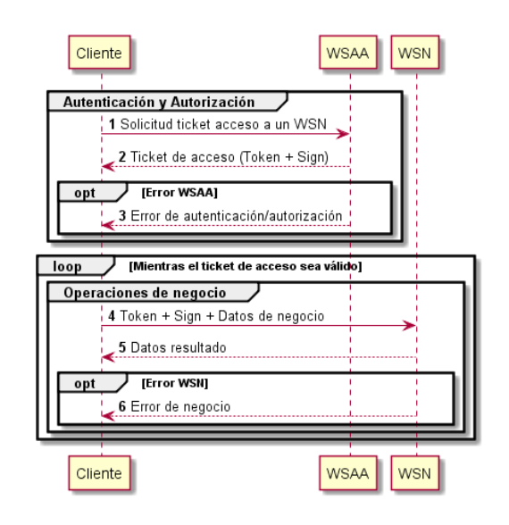
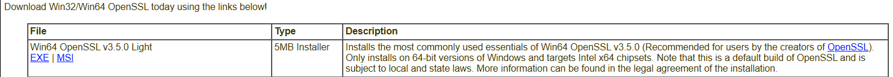
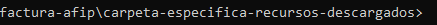
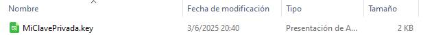
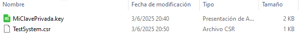
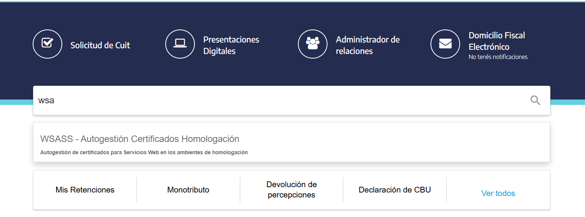
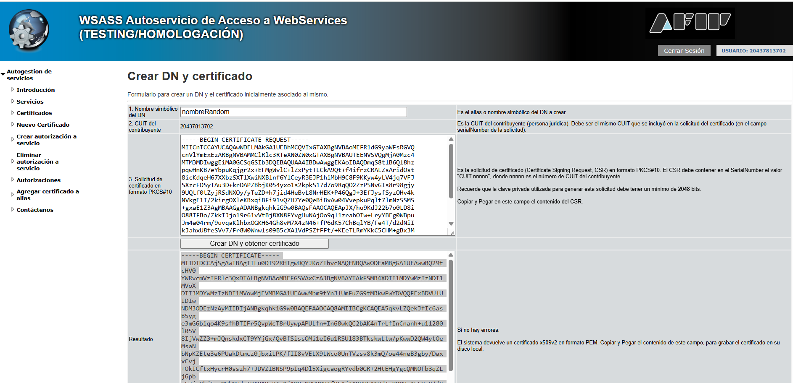

# Toda la información está sacada de [AFIP - ARCA](https://www.afip.gob.ar/ws/)

## proyecto de factura electronica

Empezar leyendo el pdf para desarrolladores [aquí](https://www.afip.gob.ar/fe/ayuda/documentos/WSSEG-ManualParaElDesarrollador_ARCA-0.9.pdf)

* ARCA permite 2 modos, el de **omologcion o testing**(recomendable para pruebas) y el de **producción**
* Recomiendo primero ir a la [documentación](https://www.afip.gob.ar/ws/documentacion/arquitectura-general.asp) 

## Arquitectura general de los procesos



-1 solicitar ticket de acceso a un WSN
Vamos a necesitar tener instalados los programas

* [Openssl](https://slproweb.com/products/Win32OpenSSL.html) -> le dan click al primero que les salga 
una ves instalado necesitamos Editar las variables de entorno de windows, la ruta que deben poner es (recomiendo que creen la ruta(path) en sistema y no para usuario):

```bash
C:\Program Files\OpenSSL-Win64\bin
```

despues abren CMD y ponen

```bash
openssl --version
```

una ves instalado onpenssl nos vamos a leer el manual de [certificados](https://www.afip.gob.ar/ws/WSASS/WSASS_manual.pdf).
Necesitamos generar un archivo .csr y la clave privada .key.
En la pagina 10 del pdf muestra "CÓMO GENERAR UNA SOLICITUD DE CERTIFICADO (CSR)".
Nos deja el codigo **PRIMERO DEBEMOS GENERAR LA CLAVE PRIVADA PARA DESPUES USARLA Y SACAR EL CERTIFICADO**

```bash
//hace que genere la clave privada de 2048 bits - borrar comentario
openssl genrsa -out MiClavePrivada.key 2048 
```

'Se recomienda usar una carpeta especifica para los archivos descargados del proyecto'



despues de estar en la carpeta especifica pegamos el codigo anterior y nos descargaria la clave:



* ahora tenemos que generar el archivo .CSR usando el codigo que se encuentra en el [pdf](https://www.afip.gob.ar/ws/WSASS/WSASS_manual.pdf) en la pagina 11

```bash
openssl req -new -key TestSystem.key
-subj "/C=AR/O=MiEmpresa/CN=TestSystem/serialNumber=CUIT 20123456789"
-out TestSystem.csr
```

Debemos modificar el codigo anterior con nuestros datos

en TestSystem.key -> ponemos el nombre de nuestro archivo.key
en MiEmpresa -> ponemos el nombre de nuestro comercio
en CUIT -> ponemos el del dueño del local, en este caso el nuestro
en TestSystem.csr pueden cambiarlo si gustan

como quedaria (recomiendo dejar los codigos en 1 linea para asegurar la ejecución):

```bash
openssl req -new -key MiClavePrivada.key -subj "/C=AR/O=TutorialDePrueba/CN=TestSystem/serialNumber=CUIT 20437813702" -out TestSystem.csr
```

Se les debe crear un nuevo archivo .csr


## Ahora vamos a utilizar ese archivo .csr 

* vamos a la pagina de [AFIP](https://auth.afip.gob.ar/contribuyente_/login.xhtml)
Entramos a nuestra cuenta de afip y en el buscador ponemos WSA  como estamos en ambiente de testing usamos ese, despues en produción lo cambiamos.

Una ves dentro dbemos reyenar los campos:

1. Nombre simbolico de DN -> ponemos el que querramos
2. CUIT del contribuyente (se pone automatico)
3. Solicitud de certificado en formato PKCS#10 -> debemos copiar el contenido de nuestro archivo .csr y pegarlo Luego le damos en "Crear DN y obtener certificado"
4. copiamos lo que nos da, vamos a nuestra carpeta donde tenemos los demas archivos, abrimos un bloc de notas y lo pegamos, pero al guardar le cambian la extension de .TXT a .crt (extension de certificado)

